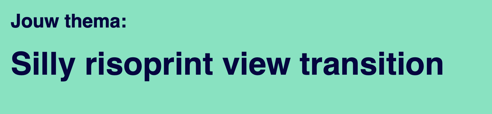

# [live-link](https://sammy-view-transition.netlify.app)
hier kan je de [live link](https://sammy-view-transition.netlify.app) vinden van de huidige coding spike 

# Screenshot

# Aan welke prompt heb je gewerkt

# Welke inspiratie heb je opgedaan? 

* in issue #86 ga ik bezig met het ontwerpen en inspiratie opdoen, hier kan je de gehele documentatie vinden
* Tijdens het opdoen van inpsiratie heb ik met moodboards gewerkt

## Maken van moodboards
Ik wil per woord een moodboard maken en het uiteindelijk combineren. Hier kan je de woorden vinden:

* Risoprint
* Silly

### Risoprint 
Wat is een risoprint eigenlijk? Het is eigenlijk een soort zeefdruk of stencildruk waarbij er word geëxperimenteerd met de verschillende drukkleuren (CMYK). Bij deze techniek ontstaan er unieke texturen bij het printen 

### Silly 
Ik heb hierop vooral op termen gezocht als:
* Silly 
* Silly design 
* en zo door...

## Wat valt je op?
* De kleuren 
* texturen & patronen
* de positie
* de transparantie 

